# MetroManage – Sequence Diagrams (UC01–UC13)

---

## UC01 – Manage Users

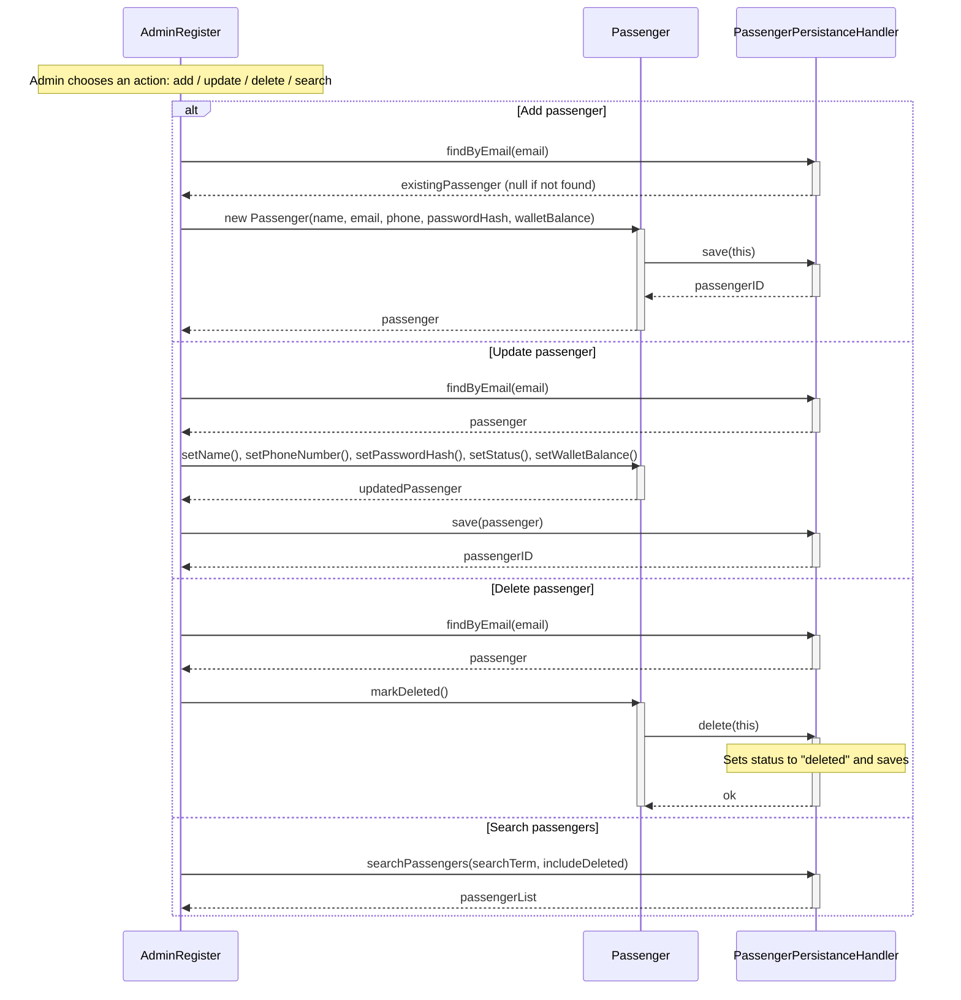

---

## UC02 – Manage Fleet

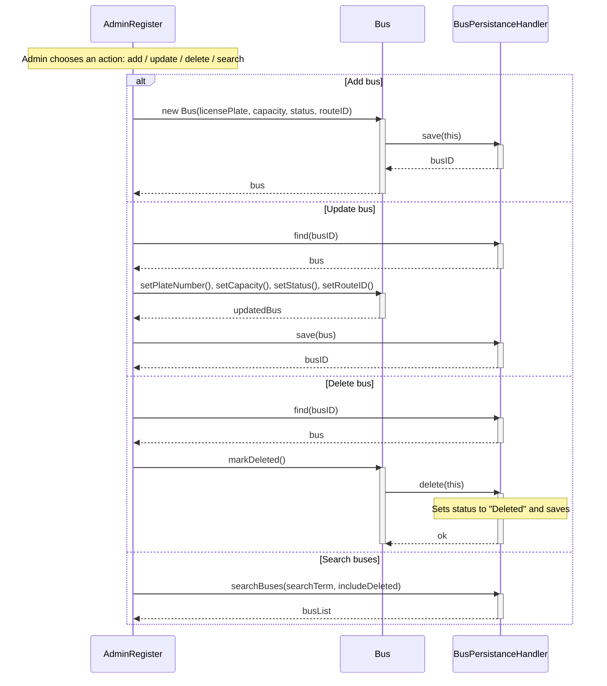

---

## UC03 – Allocate Buses

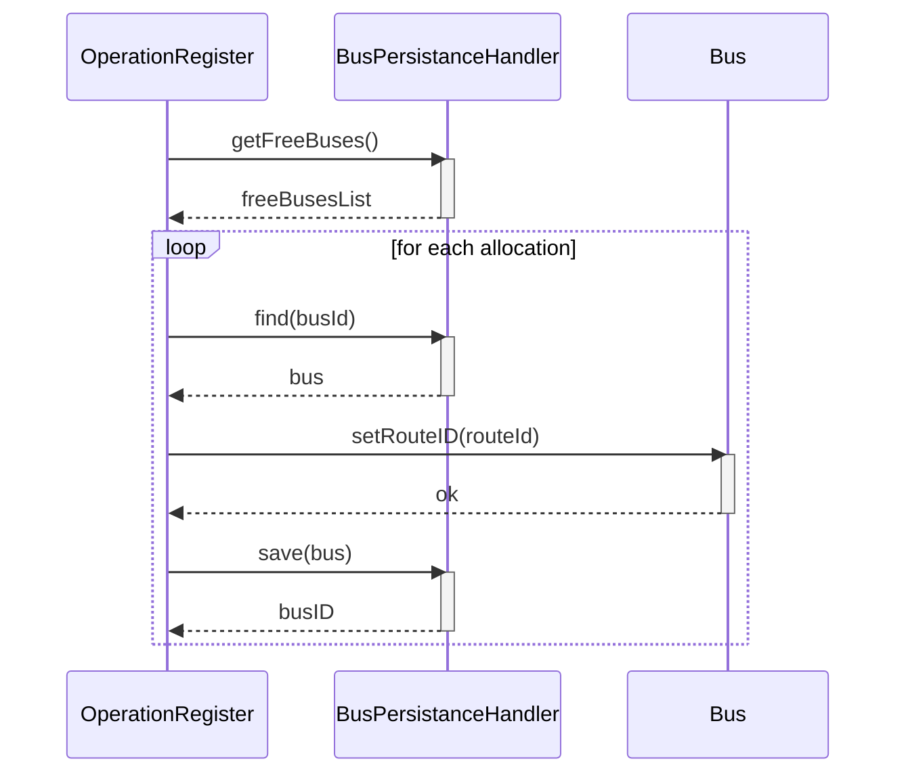

---

## UC04 – Re-allocate Buses based on Delay Index

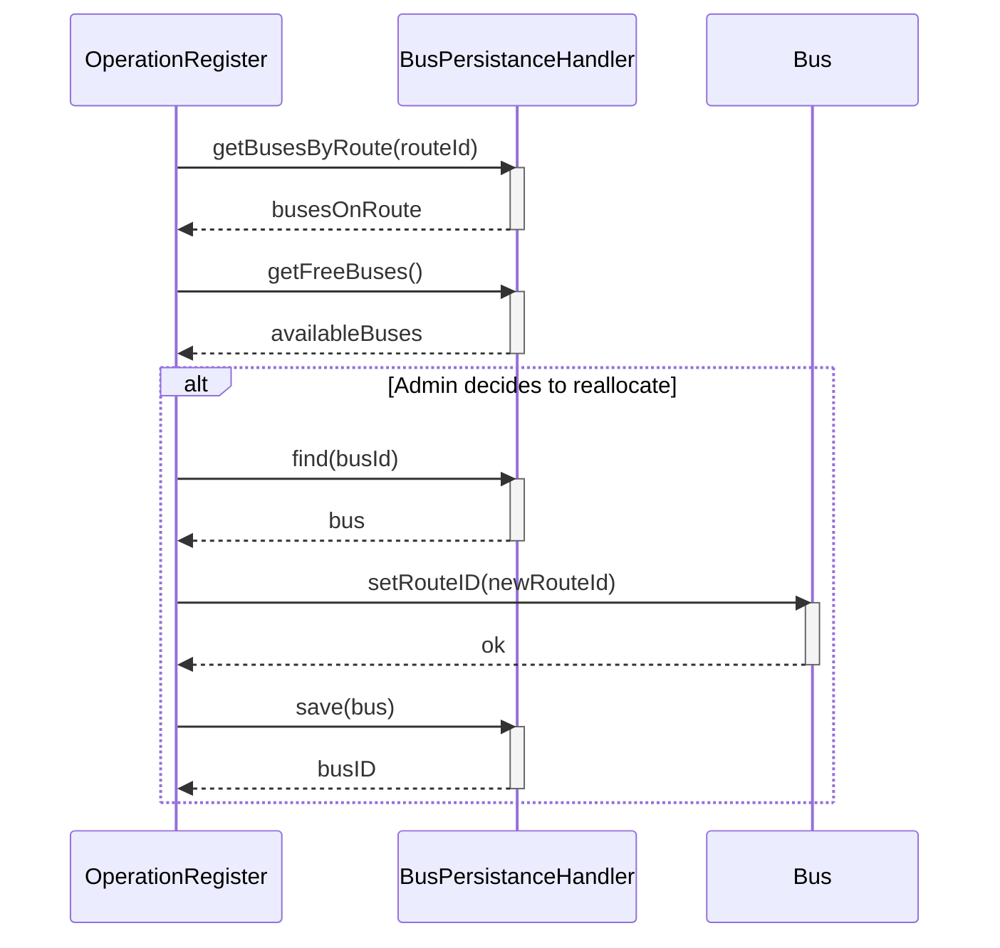

---

## UC05 – View Boarding Totals

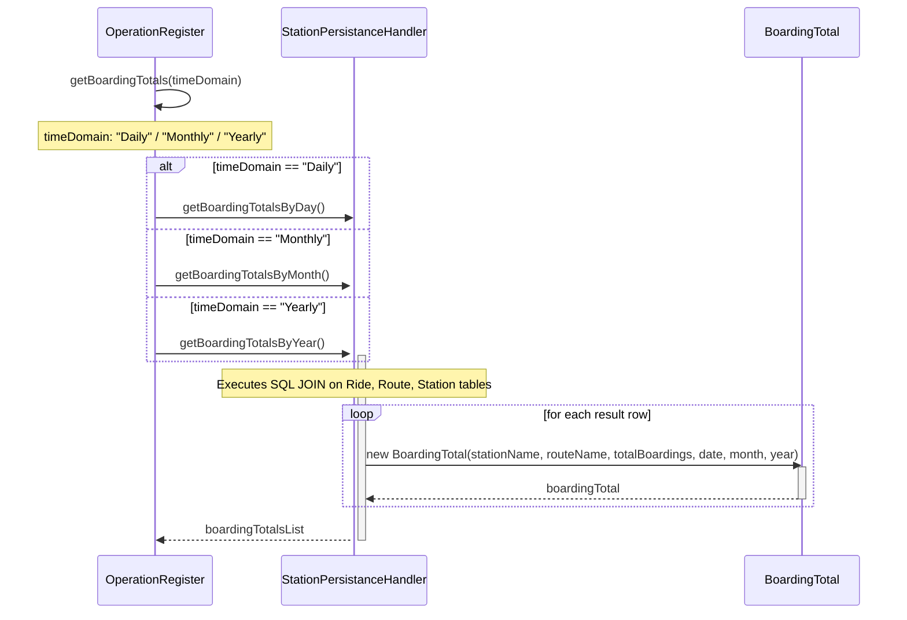

---

## UC06 – Passenger Login

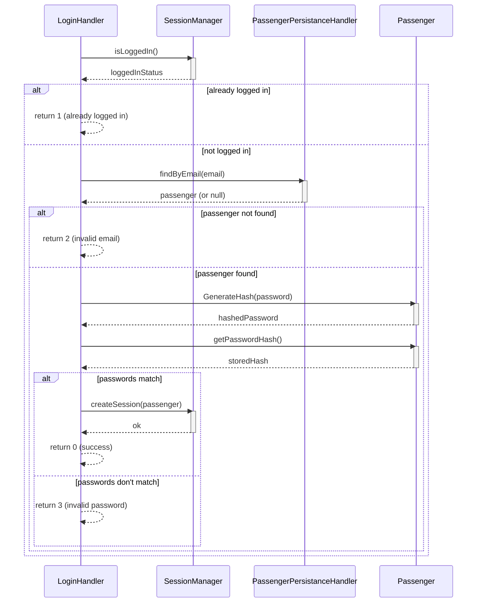

---

## UC07 – Purchase Ticket

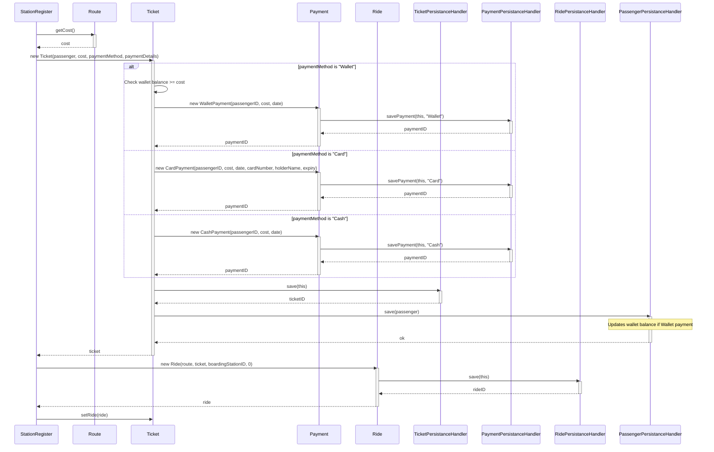

---

## UC08 – Checkin

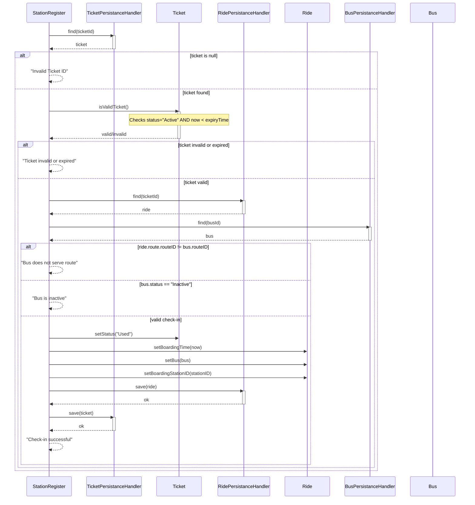

---

## UC09 – Submit Feedback

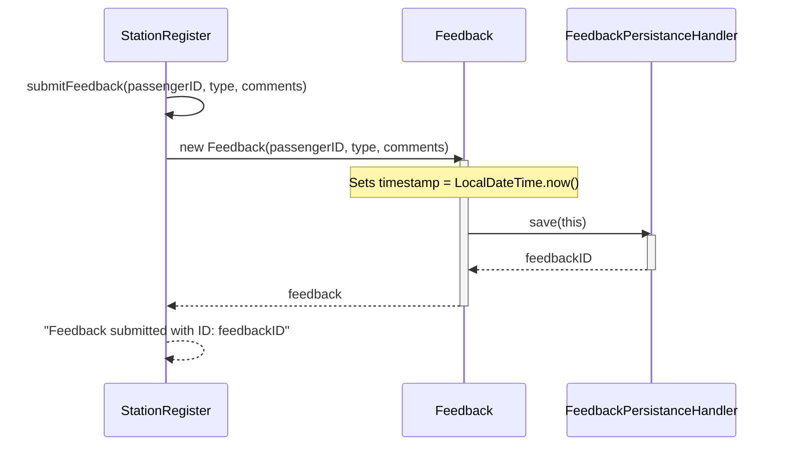

---

## UC10 – CheckOut

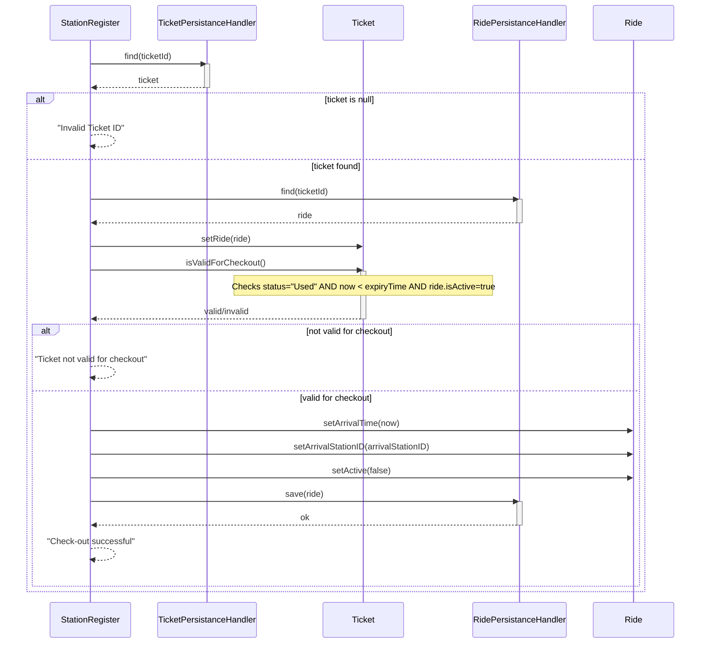

---

## UC11 – View Schedule

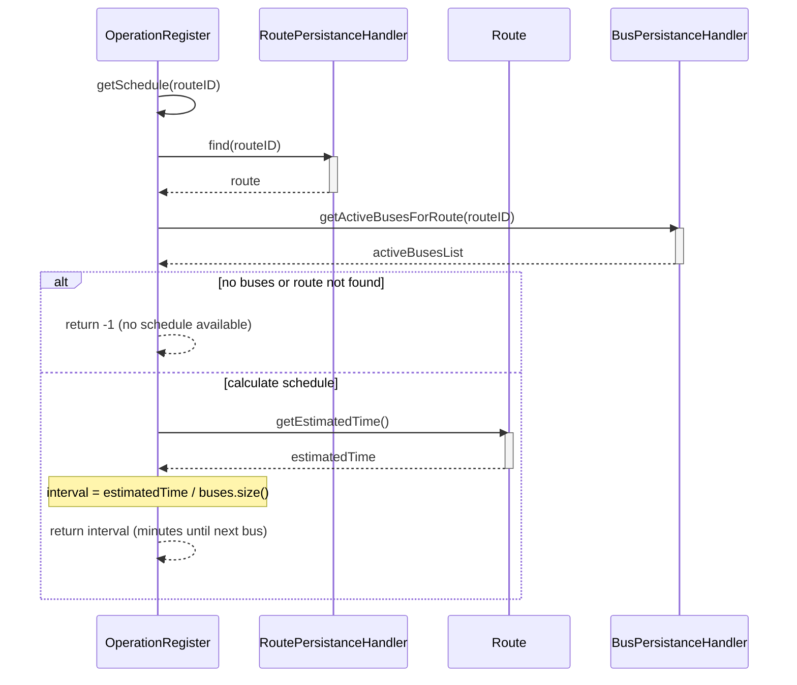

---

## UC12 – Check Balance

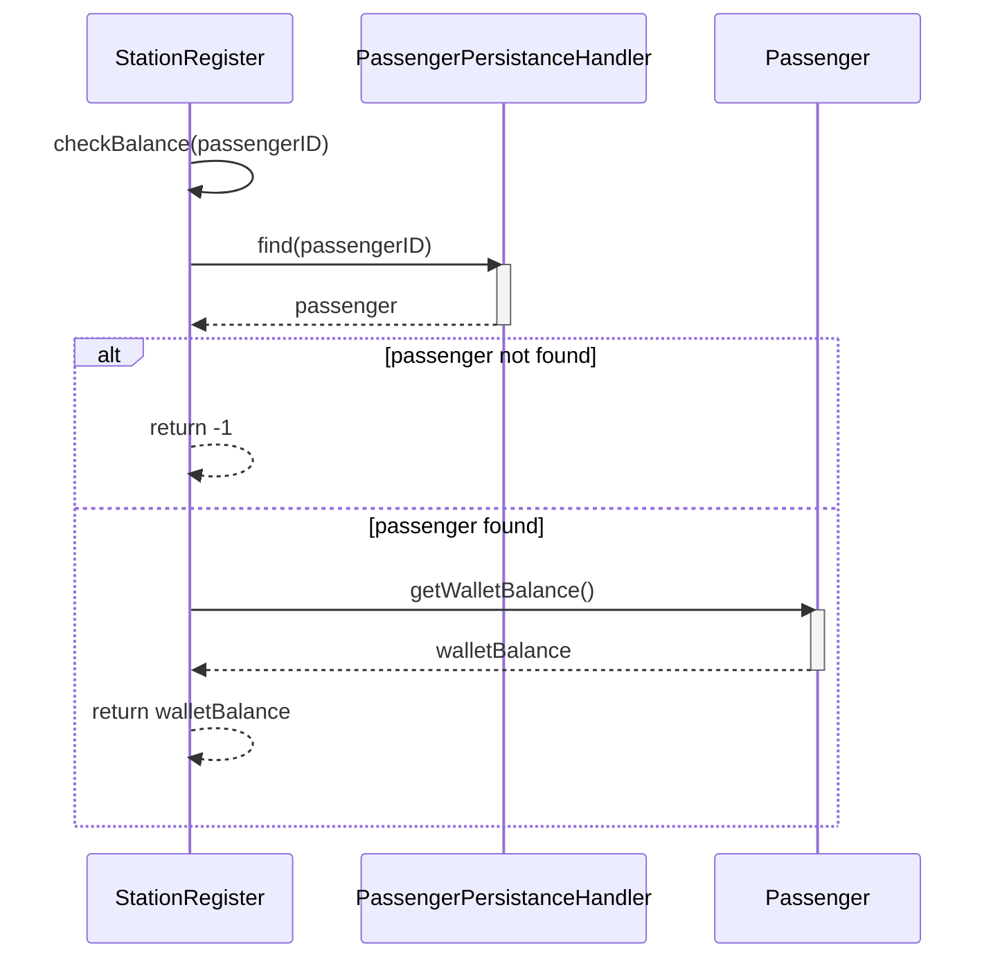

---

## UC13 – View Peak Hours

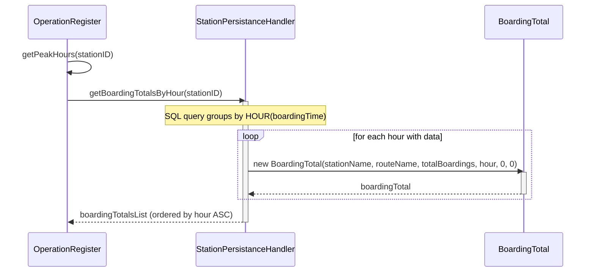
